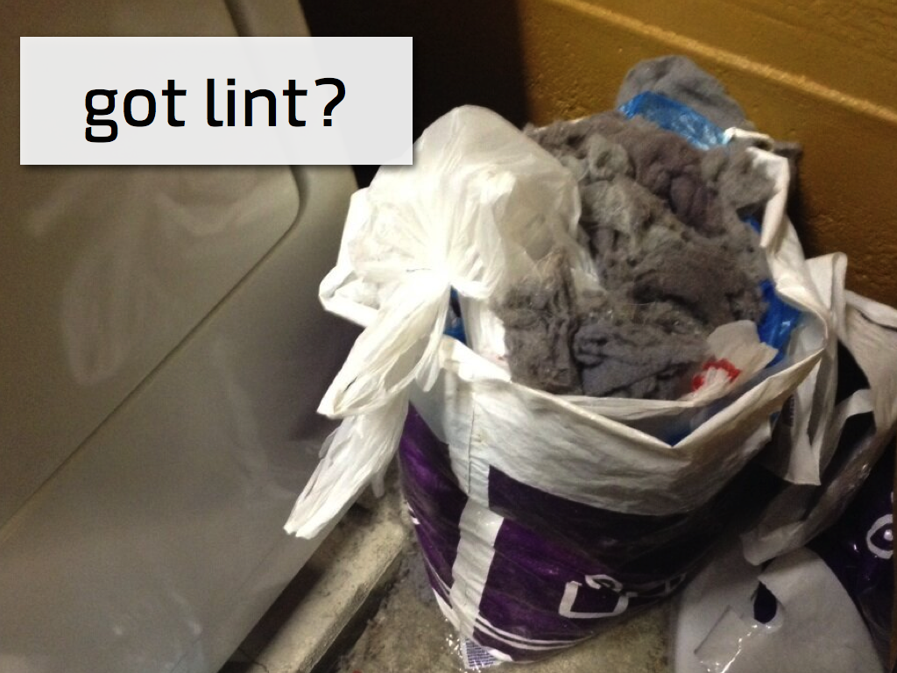

 full-page transition=fade

!SLIDE execute

# hello_world.rb #

    @@@ ruby
    welcome = 'welcome everybody'

!SLIDE commandline incremental

# Checking Syntax #

    $ ruby -cw hello_world.rb
    Syntax OK

!SLIDE
# hello\_world_bad.rb #

    @@@ ruby
    welcome == 'welcome everybody

!SLIDE commandline small incremental

# does it blend? #

    $ ruby -cw hello_world_bad.rb
    hello_world_bad.rb:1: unterminated string meets end of file
    hello_world_bad.rb:1: warning: possibly useless use of == in void context

!SLIDE transition=fade

!SLIDE

# clean your lint #

* [https://github.com/SublimeLinter/SublimeLinter](https://github.com/SublimeLinter/SublimeLinter)
* [https://tutsplus.com/lesson/sublime-linter](https://tutsplus.com/lesson/sublime-linter/)